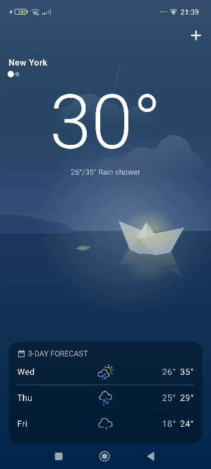
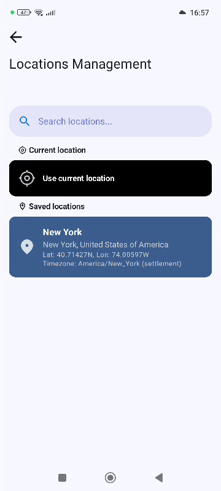
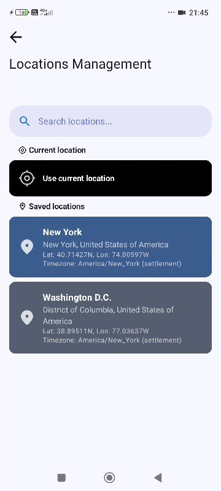

# 🌍 Solaris - Location-Based Data Aggregator

**Solaris** is a **case study Android application** that demonstrates how to fetch location data and enrich it with related information from multiple sources.  
It integrates **points of interest (POI)** (AI-generated using Firebase AI Logic), **weather**, and other contextual details to showcase modern Android development practices.


### 🚀 Feature Highlights

- 🛰️ Real-time location tracking with Google Play Services
- 💻 AI-generated data provided by Firebase AI Logic (Gemini models)
- 🗂️ Offline-first architecture with local data storage and background syncing
- ⏳ Persistent background work handled by WorkManager (DelegatingWorker + Hilt) for data syncing
- 🎨 Modern UI built with Jetpack Compose and Material 3, using Coil for images and Lottie for animations
- 🌐 Networking via Retrofit and OkHttp
- 🔒 Runtime permissions handled via Accompanist Permissions
- 🏗 Modular architecture with Hilt for dependency injection


### 📸 Screenshots
<div style="display: flex; justify-content: space-around; flex-wrap: wrap;">
  
  
  
  
</div>


## 🛠️ Tech Stack

### Core
- **[MVVM Architecture](https://www.geeksforgeeks.org/mvvm-model-view-viewmodel-architecture-pattern-in-android/)** - Separation of concerns and testable code.
- **[Kotlin](https://kotlinlang.org)** - Concise and multiplatform programming language by JetBrains.
- **[Jetpack Compose](https://developer.android.com/jetpack/compose)** - Modern declarative UI.
- **[Navigation 3](https://developer.android.com/guide/navigation/navigation-3)** - Navigation library designed to work with Compose.
- **[Kotlin Serialization](https://github.com/Kotlin/kotlinx.serialization)** - serialization.
- **[Hilt](https://dagger.dev/hilt)** - Dependency Injection.
- **[KSP](https://kotlinlang.org/docs/ksp-overview.html)** - Annotation processing.
- **[Timber](https://github.com/JakeWharton/timber)** - Logging library.

### Data
- **[Firebase AI](https://firebase.google.com/docs/ai-logic)** - Generative AI models from Google.
- **[Retrofit](https://square.github.io/retrofit/)** - Making network requests.
- **[OkHttp](https://square.github.io/okhttp/)** - Custom HTTP client with logging interceptor (shared with Retrofit & Coil).
- **[Room](https://developer.android.com/training/data-storage/room)** - Local database.
- **[DataStore](https://developer.android.com/topic/libraries/architecture/datastore)** - Preferences storage.
- **[Fused Location Provider](https://developers.google.com/location-context/fused-location-provider)** - Device Location API.

### Background Work
- **[WorkManager](https://developer.android.com/topic/libraries/architecture/workmanager)** - API for persistent background work.

### UI/UX
- **[Coil](https://coil-kt.github.io/coil/)** - Async image loading.
- **[Lottie](https://airbnb.io/lottie/)** - Animations.
- **[Accompanist Permissions](https://google.github.io/accompanist/permissions/)** - Runtime permissions handling.
- **[Splash Screen API](https://developer.android.com/guide/topics/ui/splash-screen)** - Launch the app with animation.


## 🚀 How It Works

1. **Search Location** - The user searches for a location by name or through device coordinates.
2. **Sync Related Data** - `SyncRelatedDataUseCase` launches coroutines to sync weather, POI, and other related data  
                           from their dedicated repositories in parallel, emitting real-time sync status updates. 
3. **Store & Cache** - Data is cached locally using Room for offline access.
4. **Display Results** - `GetLocationsWithRelatedDataUseCase` aggregates the data and exposes it to the UI as `LocationWithRelatedData`.
5. **Background Sync** - WorkManager ensures data stays up-to-date by running periodic syncs in the background.


---

## 🔧 Setup and installation
> [!NOTE]
> All APIs used in this project are free to use.

1. Clone the repository
2. **Set up MeteoSource API key** (for location and weather data)  
     - Sign up at [Meteosource](https://www.meteosource.com/)
     - Place your API key in the root-level `apikeys.properties` file:
       ```properties
       METEOSOURCE_API_KEY=<YOUR_API_KEY>
       ```
     > During the build process,  
       if apikeys.properties file doesn't exist, the network module’s Gradle script will automatically generate it with the required field.

       
3. **Set up Firebase AI Logic** (for AI-generated POI data)   
     - Follow [Get started with the Gemini API](https://firebase.google.com/docs/ai-logic/get-started?api=dev) to create a Firebase project and enable ***Firebase AI Logic***.  
       Be sure to place `google-services.json` in the app module: `app/google-services.json`.  
       Enable ***AppCheck*** in your Firebase project to prevent API abuse.

       
4. **Run the app**  
   Build and run the app on an Android device or emulator.

---

## 📜 License
Solaris is licensed under the [Apache License 2.0](LICENSE). See the `LICENSE` file for
details.

This project is licensed under the MIT License.
